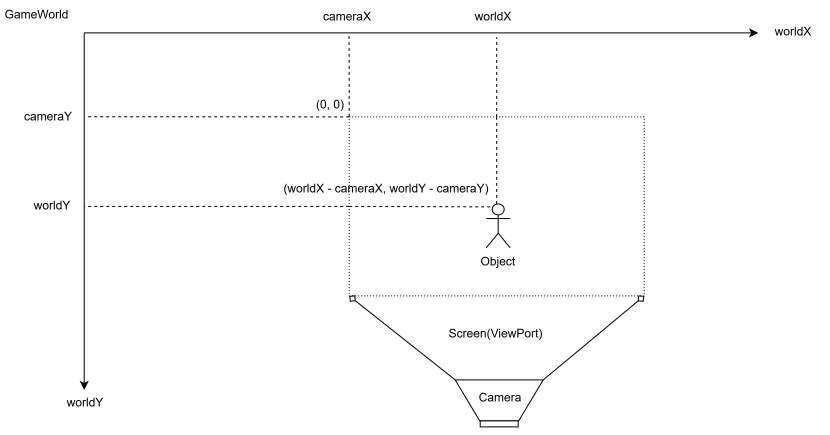

# Day24: Camera2Dクラスの作成
ゲームのステージ画面が大きくなると、カメラが必要になります。具体的には以下のようなゲームで必要です。
```text
横スクロールアクション 
見下ろし型RPG 
広いマップを移動する探索ゲーム 
ランゲーム 
タイルマップゲーム
```
これらのゲームでは、プレイヤーが移動すると、画面も一緒に移動します。そのための基礎として`Camera2D`を作成します。

## Camera2Dの概要
`Camera2D`は、ゲーム世界のどの範囲を画面に表示するかを決めるクラスです。ゲームワールド全体が画面より大きい場合一度に画面に表示できるのはワールド全体の一部です。そのどの部分を表示するかを決めるのが`Camera2D`クラスです。

### 座標の種類
2Dゲームでは、主に次の2種類の座標があります。
```text
スクリーン座標 
ワールド座標
```
#### スクリーン座標
画面上の座標のことです。画面の左上を`(0,0)`として右方向をx軸方向、下方向をy軸方向とします。

#### ワールド座標
ゲーム世界の中の座標です。ゲーム画面からはみ出ることが可能です。プレイヤーや敵、ブロック、アイテムなどは、ワールド座標で位置を持ちます。画面の左上を`(0,0)`として右方向をx軸方向、下方向をy軸方向とします。

### カメラがない場合
ワールド座標をそのままスクリーン座標として描画します。
```java
screenX = worldX;
screenY = worldY;
```
もし、画面幅が`800px`なら、`worldX = 100`のオブジェクトは画面上の`x = 100`に表示されます。しかし、`worldX = 1200`のオブジェクトは、画面の外にあります。つまり、カメラがないと、画面外のワールドを見ることができません。

### カメラがある場合
カメラに座標を持たせます。カメラの座標は画面（スクリーン座標）上の左上（原点）をワールド座標（cameraX, cameraY）で表します。カメラのViewportはスクリーン全体です。あるオブジェクト(worldX, worldY)のスクリーン座標(screenX, screenY)を求めるには図より以下の様になります。
```java
screenX = worldX - cameraX;
screenY = worldY - cameraY;
```



#### Graphics2Dのtranslateを使う
`Graphics2D`には、描画座標全体をずらす`translate()`メソッドがあります。定義は`g.translate(dx, dy);`であり、その後の描画をすべて、引数で指定されたdx, dy分だけずらして描画されます。上述のカメラがある場合の(screenX, screenY)の座標は、オブジェクトのゲームワールド内座標からそれぞれcameraX、cameraYだけ左にずらしたものなので、以下の様に書き換えられます。
```java
g.translate(-cameraX,-cameraY);
```
これにより、各オブジェクト側で毎回`screenX = worldX - cameraX;`のような計算を書かなくてもよくなります。

## Camera2Dの実装
```java
public class Camera2D {
    private double x;
    private double y;

    public Camera2D() {
        this(0.0, 0.0);
    }

    public Camera2D(double x, double y) {
        this.x = x;
        this.y = y;
    }

    public double getX() {
        return this.x;
    }

    public double getY() {
        return this.y;
    }

    public void setPosition(double x, double y) {
        this.x = x;
        this.y = y;
    }

    public void move(double dx, double dy) {
        this.x += dx;
        this.y += dy;
    }

    public void apply(Graphics2D g) {
        if (g == null) {
            throw new IllegalArgumentException("graphics must not be null.");
        }
        g.translate(-x, -y);
    }

    public double screenToWorldX(double screenX) {
        return x + screenX;
    }

    public double screenToWorldY(double screenY) {
        return y + screenY;
    }

    public double worldToScreenX(double worldX) {
        return worldX - x;
    }

    public double worldToScreenY(double worldY) {
        return worldY - y;
    }
}
```
### フィールド
フィールドにはカメラの座標`x`、`y`を持ちます。カメラを滑らかに動かすために`double`型で定義します。
```java
private double x;
private double y;
```

### コンストラクタ
コンストラクタで初期化しますが、引数を何も与えない場合、`0.0, 0.0`で初期化します。
```java
public Camera2D() {
    this(0.0, 0.0);
}

public Camera2D(double x, double y) {
    this.x = x;
    this.y = y;
}
```

### メソッド
#### getter
カメラの座標をそれぞれ取得するメソッドを用意します。
```java
public double getX() {
    return this.x;
}

public double getY() {
    return this.y;
}
```

#### setter
カメラ座標を設定するメソッドを一つにまとめて用意します。
```java
public void setPosition(double x, double y) {
    this.x = x;
    this.y = y;
}
```
#### moveメソッド
指定された分だけカメラ位置を移動するメソッドです。
```java
public void move(double dx, double dy) {
    this.x += dx;
    this.y += dy;
}
```


#### applyメソッド
`apply()`は、`Graphics2D`にカメラ変換を適用するメソッドです。ゲームワールド内で座標を更新し続けてゲームを更新しますが、実際に画面に描画するにはカメラを動かして、ゲームワールドの一部を表示していく必要があり、そのためのメソッドです。`Graphics2D.translate()`を使用します。
```java
public void apply(Graphics2D g) {
    if (g == null) {
        throw new IllegalArgumentException("graphics must not be null.");
    }
    g.translate(-x, -y);
}
```

#### screenToWorldメソッド
マウス座標などを使う場合、スクリーン座標をワールド座標に変換したいことがあります。カメラ座標にスクリーン座標を足したものがワールド座標になるので以下の様に実装します。
```java
public double screenToWorldX(double screenX) {
    return x + screenX;
}
```

#### worldToScreenメソッド
逆に、ワールド座標をスクリーン座標に変換したい場合もあります。これは、applyメソッドをx成分、y成分に分割したようなものでデバック表示や、UIとの連携で役立ちます。
```java
public double worldToScreenX(double worldX) {
    return worldX - x;
}

public double worldToScreenY(double worldY) {
    return worldY - y;
}
```

## GameRendererにCamera2Dを持たせる
次に、`GameRenderer`に`Camera2D`を持たせます。
```java
private final Camera2D camera;
```
コンストラクタでは、デフォルトのカメラを作ります。
```java
this.camera = new Camera2D();
```
また、外からカメラを取得できるようにします。
```java
public Camera2D getCamera() {
    return camera;
}
```
これにより、ゲーム側からカメラ位置を変更できます。
```java
engine().getRenderer().getCamera().setPosition(200, 0);
```

### GameRendererの描画にカメラを適用する

`GameRenderer` でオブジェクトを描画する際、カメラの位置に応じた画面上の表示位置を正しく反映させるため、描画処理にカメラ変換（座標系の移動）を適用します。

#### 処理の全体像

カメラ変換の適用は、オブジェクト個々に対して位置計算を行うのではなく、**ワールドを描画するための描画コンテキスト（画用紙）全体**に対して一括で行います。

```java
Graphics2D worldGraphics = (Graphics2D) g.create();
try {
    // ワールド全体の描画コンテキストにカメラ変換を適用
    camera.apply(worldGraphics);

    for (GameObject o : objects) {
        Graphics2D objectGraphics = (Graphics2D) worldGraphics.create();
        try {
            o.onDraw(objectGraphics, renderAlpha);
        } finally {
            objectGraphics.dispose();
        }
    }
} finally {
    worldGraphics.dispose();
}

```


#### なぜ `worldGraphics`（コピー）を作成するのか？

元の描画コンテキスト `g` に対して直接 `camera.apply(g)` を実行すると、それ以降のすべての描画処理にカメラの座標変換が残ってしまいます。

ゲームの画面は、大きく分けて以下の2つのレイヤーで構成されます。

| レイヤー | 対象要素 | カメラの影響 |
| --- | --- | --- |
| **ワールド描画** | プレイヤー、敵、ブロック、マップなど | **受ける**（カメラ移動に合わせて動く） |
| **UI・オーバーレイ描画** | HPバー、スコア、メニュー、デバッグ文字など | **受けない**（画面の一定位置に固定される） |

元の `g` から `worldGraphics` という複製を作成してカメラ変換を適用することで、ワールドを描画し終えて `worldGraphics.dispose()` を呼んだ際、カメラの影響を受けていない元の `g` の状態へと安全に戻すことができます。


#### 描画処理の実装（GameRenderer.java）

`GameRenderer` の内部でワールド描画用メソッド（`renderWorld`）を独立させ、カメラ変換を閉じ込める形で実装します。

```java
private void renderWorld(Graphics2D g, List<GameObject> objects, double alpha) {
    // ワールド描画専用の Graphics2D を複製
    Graphics2D worldGraphics = (Graphics2D) g.create();
    try {
        // 複製したコンテキストにのみカメラ変換を適用
        camera.apply(worldGraphics);

        for (GameObject o : objects) {
            //各オブジェクトごとに描画設定を独立して持たせるようにする
            Graphics2D objectGraphics = (Graphics2D) worldGraphics.create();
            try {
                o.onDraw(objectGraphics, alpha);
            } finally {
                objectGraphics.dispose();
            }
        }
    } finally {
        // 破棄することで元の g にはカメラ変換を残さない
        worldGraphics.dispose();
    }
}
```
ここでオブジェクトごとに`worldGraphics.create()`を行っている主な理由は、各`GameObject`が行う描画設定（回転・拡大縮小・色・クリッピング領域など）による「描画状態の汚染（副作用）」を他のオブジェクトへ伝播させないためです。


#### GameEngineクラス経由でのカメラアクセス
現在、ゲーム側からカメラを使うには、次のように書けます。
```java
engine().getRenderer().getCamera()
```
これでも動きます。しかし、よく使うなら`GameEngine`にも`getter`を用意すると便利です。
```java
public Camera2D getCamera() {
    return renderer.getCamera();
}
```
これにより、ゲーム側では次のように書けます。
```java
engine().getCamera().setPosition(200, 0);
```
`GameEngine`が`GameRenderer`の内部構造を少し隠してくれるので、使いやすくなります。
