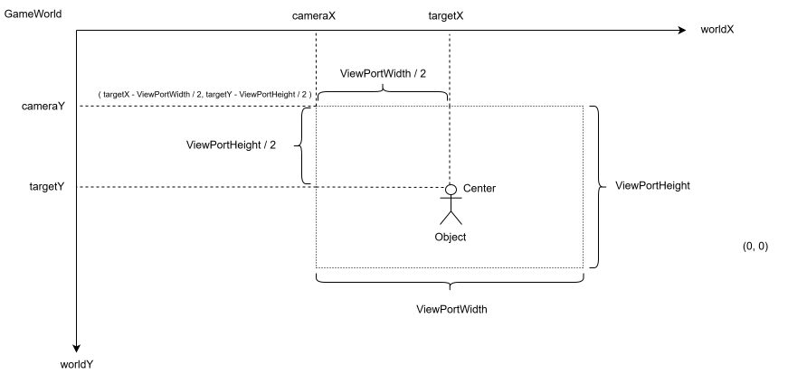
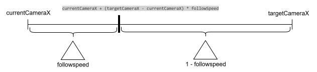

# Day25: CameraFollowの作成
Camera2Dでは、カメラを手動で動かすことでゲームワールドの見える位置が変化しましたが、実際のゲームでは、プレーヤーを自動で追いかけることが多いです。このような「対象を追いかけるカメラ」を作るために、`CameraFollow`を作成します。

## CameraFollowとはなにか
`CameraFollow`は、`Camera2D`を特定の対象に合わせて動かすための制御クラスです。以下のような情報を持ちます。
```text
Camera2D camera      : 動かす対象のカメラ
GameObject target    : 追いかける対象
viewportWidth        : 画面の幅
viewportHeight       : 画面の高さ
```
### 画面の中央に対象を表示する
プレイヤーを画面中央に表示したい場合のカメラ位置を求めます。図より、
```text
cameraX = targetX - viewportWidth / 2
cameraY = targetY - viewportHeight / 2
```
とわかります。


ただし、targetX, targetYはオブジェクトの左上の座標を指していることが多いので、実際には中央に表示されず、少しずれていることがあります。現時点ではシンプルに`target.getX()`と`target.getY()`のようにして追いかけます。

## CameraFollowの基本実装
まずは、対象を即座に中央へ合わせる`CameraFollow`を作ります。
```java
public class CameraFollow {
    private final Camera2D camera;
    private GameObject target;
    private int viewportWidth;
    private int viewportHeight;

    public CameraFollow(Camera2D camera, GameObject target, int viewportWidth, int viewportHeight) {
        if (camera == null) {
            throw new IllegalArgumentException("camera must not be null.");
        }
        if (target == null) {
            throw new IllegalArgumentException("target must not be null.");
        }
        if (viewportWidth <= 0) {
            throw new IllegalArgumentException("viewportWidth must be greater than 0.");
        }
        if (viewportHeight <= 0) {
            throw new IllegalArgumentException("viewportHeight must be greater than 0.");
        }

        this.camera = camera;
        this.target = target;
        this.viewportWidth = viewportWidth;
        this.viewportHeight = viewportHeight;
    }

    public void update() {
        double cameraX = target.getX() - viewportWidth / 2.0;
        double cameraY = target.getY() - viewportHeight / 2.0;
        camera.setPosition(cameraX, cameraY);
    }
}
```
この`update()`を毎フレーム呼ぶことで、カメラが対象を追いかけます。

## なめらか追従
ここまでの`CameraFollow`は、対象に即座に追従します。
```java
camera.setPosition(cameraX, cameraY);
```
これは分かりやすいですが、動きが硬く見える場合があります。たとえば、プレイヤーが急に動くと、カメラも急に動きます。これにより、画面が少し忙しく感じることがあります。そのため、実際のゲームでは、カメラを少し遅れて追従させることがあります。これを「なめらか追従」と呼びます。

### なめらか追従の考え方
なめらか追従では、カメラを一気に目標位置へ移動させません。現在位置から目標位置へ、少しずつ近づけます。考え方は、lerpに近いです。
```java
newCameraX = currentCameraX + (targetCameraX - currentCameraX) * followSpeed 
```

たとえば、`followSpeed = 0.1`の場合、カメラは毎フレーム、目標位置との差の10%だけ近づきます。これにより、カメラが少し遅れて対象を追いかけるようになります。

#### CameraFollowにsmoothを追加する
`CameraFollow`に、なめらか追従の設定を追加します。
```java
private boolean smooth;
private double followSpeed;

public void setSmooth(boolean smooth) {
    this.smooth = smooth;
}

public boolean isSmooth() {
    return smooth;
}

public void setFollowSpeed(double followSpeed) {
    if (followSpeed <= 0.0 || followSpeed > 1.0) {
        throw new IllegalArgumentException("followSpeed must be greater than 0 and less than or equal to 1.");
    }
    this.followSpeed = followSpeed;
}

public double getFollowSpeed() {
    return followSpeed;
}
```
followSpeed は、`0.0`より大きく、`1.0`以下の値にします。
```text
followSpeed = 1.0 : 即座に追従 
followSpeed = 0.1 : ゆっくり追従 
followSpeed = 0.2 : 少し速めに追従
```
`update()`メソッドを修正します。
```java
public void update() {
    double targetCameraX = target.getX() - viewportWidth / 2.0;
    double targetCameraY = target.getY() - viewportHeight / 2.0;
    if (smooth) {
        double nextX = camera.getX() + (targetCameraX - camera.getX()) * followSpeed;
        double nextY = camera.getY() + (targetCameraY - camera.getY()) * followSpeed;
        camera.setPosition(nextX, nextY);
    } else {
        camera.setPosition(targetCameraX, targetCameraY);
    }
}
```

### CameraFollowの完成版
```java
package engine.graphics;

import engine.object.GameObject;

public class CameraFollow {
    private final Camera2D camera;
    private GameObject target;
    private int viewportWidth;
    private int viewportHeight;

    private boolean smooth;
    private double followSpeed;

    public CameraFollow(Camera2D camera, GameObject target, int viewportWidth, int viewportHeight) {
        if (camera == null) {
            throw new IllegalArgumentException("camera must not be null.");
        }
        if (target == null) {
            throw new IllegalArgumentException("target must not be null.");
        }
        if (viewportWidth <= 0) {
            throw new IllegalArgumentException("viewportWidth must be greater than 0.");
        }
        if (viewportHeight <= 0) {
            throw new IllegalArgumentException("viewportHeight must be greater than 0.");
        }

        this.camera = camera;
        this.target = target;
        this.viewportWidth = viewportWidth;
        this.viewportHeight = viewportHeight;
    }

    public void update() {
        double targetCameraX = target.getX() - viewportWidth / 2.0;
        double targetCameraY = target.getY() - viewportHeight / 2.0;
        if (smooth) {
            double nextX = camera.getX() + (targetCameraX - camera.getX()) * followSpeed;
            double nextY = camera.getY() + (targetCameraY - camera.getY()) * followSpeed;
            camera.setPosition(nextX, nextY);
        } else {
            camera.setPosition(targetCameraX, targetCameraY);
        }

    }

    public void setTarget(GameObject target) {
        if (target == null) {
            throw new IllegalArgumentException("target must not be null.");
        }
        this.target = target;
    }

    public GameObject getTarget() {
        return target;
    }

    public void setSmooth(boolean smooth) {
        this.smooth = smooth;
    }

    public boolean isSmooth() {
        return smooth;
    }

    public void setFollowSpeed(double followSpeed) {
        if (followSpeed <= 0.0 || followSpeed > 1.0) {
            throw new IllegalArgumentException("followSpeed must be greater than 0 and less than or equal to 1.");
        }
        this.followSpeed = followSpeed;
    }

    public double getFollowSpeed() {
        return followSpeed;
    }
}
```
