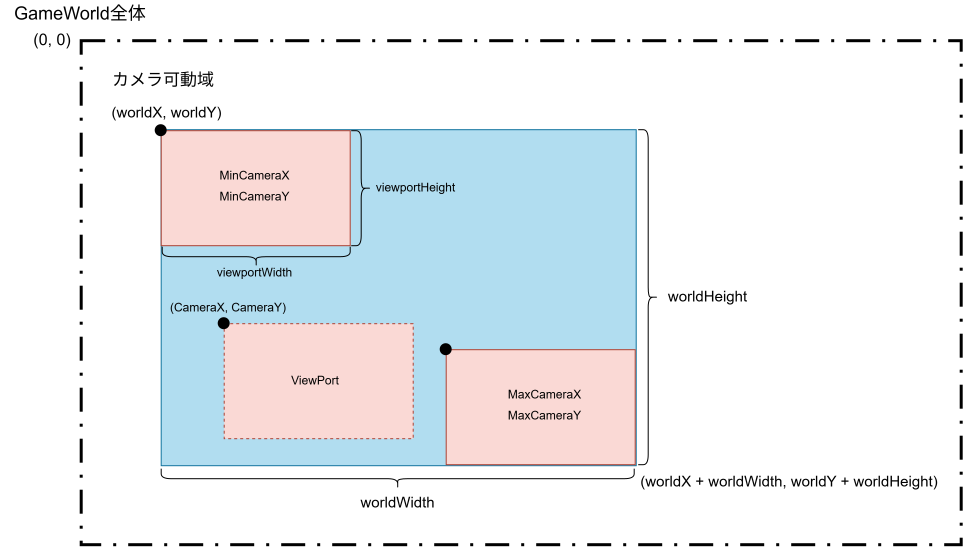

# Day26: CameraBoundsの作成
`CameraBounds`は、カメラが移動できる範囲を表すクラスです。以下の機能を有します。
```text
カメラがワールドの左端より左へ行かない 
カメラがワールドの上端より上へ行かない 
カメラがワールドの右端を越えない 
カメラがワールドの下端を越えない
```
## カメラの位置があらわすもの
`Camera2D`の`x`と`y`は、画面左上に対応するワールド座標です。たとえば、カメラ位置が`(200, 100)`なら、ワールド座標`(200, 100)`が画面左上に表示されます。

### カメラの移動範囲制限
#### カメラの最小位置
ワールドの左上を`(0, 0)`とすると、カメラが移動できる最小位置は次の通りです。
```text
minX = 0
minY = 0
```

#### カメラの最大位置
ワールド幅を`worldWidth`、ワールド高を`worldHeight`、画面幅を`viewportWidth`、画面高を`viewportHeight`とします。カメラが移動できる最大位置は次の通りです。
```text
maxX = worldWidth - viewportWidth
maxY = wordHeight - viewportHeight
```

つまり、`cameraX`と`cameraY`は以下のような範囲に含まれます
```java
0 <= cameraX && cameraX <= worldWidth - viewportWidth;
0 <= cameraY && cameraY <= wordHeight - viewportHeight;
```

### clampメソッド
値を最小値と最大値の間に収める処理を、一般に`clamp`と呼びます。たとえば、値`value`を`min`以上`max`以下に制限する場合、次のように考えます。
```text
valueがminより小さい → minにする
valueがmaxより大きい → maxにする
それ以外 → valueをそのまま使う
```
これをメソッド化します。
```java
private double clamp(double value, double min, double max) {
     return Math.max(min, Math.min(value, max)); 
}
```
まず、`Math.max(min, VALUE)`でmin以下のVALUEの場合はすべてminを返すようにします。VALUEがmin以上だった場合はVALUEを返したいのですがVALUEがmax以上だった場合maxを返す必要があるので、`VALUE = Math.min(max, value)`として、valueがmax以上だった場合はmaxを、そうでなければvalueを返します。結果として、
```java
Math.max(min, Math.min(value, max)); 
```
が目的のclamp関数です。

## CameraBoundsの実装
### フィールド
`CameraBounds`には、次の情報を持たせます。
```java
private double worldX; 
private double worldY; 
private double worldWidth; 
private double worldHeight;
```
`worldX`と`worldY`は、（カメラを動かせる）ワールド領域の左上座標です。単に`(0, 0)`としないのは、将来的に
```text
ワールドが負の座標を含む
特定エリアだけカメラ移動可能にする
部屋ごとにカメラ範囲を変える
```
可能性を考えると左上座標も持たせておくと便利です。

`worldWidth`と`worldHeight`はカメラ対象のサイズです。例えば
```text
左上 = (100, 200) 
サイズ = 2000 × 1000
```
の範囲をカメラ対象にできます。

### コンストラクタ
```java
public CameraBounds(double worldX, double worldY, double worldWidth, double worldHeight) {
     if (worldWidth <= 0.0) {
          throw new IllegalArgumentException("worldWidth must be greater than 0.");
     }
     if (worldHeight <= 0.0) {
          throw new IllegalArgumentException("worldHeight must be greater than 0.");
     }
     this.worldX = worldX;
     this.worldY = worldY;
     this.worldWidth = worldWidth;
     this.worldHeight = worldHeight;
}
```

### constrainメソッド
`CameraBounds`には、カメラ位置を範囲内に制限する`constrain()`メソッドを作ります。


図より、最大カメラ位置は、次のように計算します。
```java
double maxCameraX = worldX + worldWidth - viewportWidth;
double maxCameraY = worldY + worldHeight - viewportHeight;
```
また、最小値はワールド左上です。
```java
double minCameraX = worldX;
double minCameraY = worldY;
```
そして、カメラ位置を`clamp()`して求めます。
```java
double constrainedX = clamp(camera.getX(), minCameraX, maxCameraX);
double constrainedY = clamp(camera.getY(), minCameraY, maxCameraY);
```
最後にカメラへ設定します。
```java
camera.setPosition(constrainedX, constrainedY);
```

### ワールドが画面より小さい場合
カメラ可動域が画面よりも小さい場合、以下の様に矛盾が生じます
```text
ワールド: 幅 500 × 高さ 300（worldX = 0, worldY = 0）
画面（ビューポート）: 幅 800 × 高さ 600
minCameraX = worldX = 0
minCameraY = worldY = 0
maxCameraX = (worldX + worldWidth) - viewportWidth = (0 + 500) - 800 = -300
maxCameraY = (worldY + worldHeight) - viewportHeight = (0 + 300) - 600 = -300

//以下の矛盾が生じる→clamp()メソッドを使用すると意図しない結果を得る
minCameraX > maxCameraX
minCameraY > maxCameraY
```
ワールドが画面より小さい場合、カメラの位置をカメラ可動域の左上座標（worldX, worldY）に直接固定することにします。ゆえに`constrain()`メソッドは以下の様になります。
```java
public void constrain(Camera2D camera, double viewportWidth, double viewportHeight) {
     if (camera == null) {
          throw new IllegalArgumentException("camera must not be null.");
     }
     if (viewportWidth <= 0.0) {
          throw new IllegalArgumentException("viewportWidth must be greater than 0.");
     }
     if (viewportHeight <= 0.0) {
          throw new IllegalArgumentException("viewportHeight must be greater than 0.");
     }

     double constrainedX;
     double constrainedY;
        
     if (worldWidth <= viewportWidth) {
          constrainedX = worldX;
     } else {
          double maxCameraX = worldX + worldWidth - viewportWidth;
          constrainedX = clamp(camera.getX(), worldX, maxCameraX);
     }
     if (worldHeight <= viewportHeight) {
          constrainedY = worldY;
     } else {
          double maxCameraY = worldY + worldHeight - viewportHeight;
          constrainedY = clamp(camera.getY(), worldY, maxCameraY);
     }
     camera.setPosition(constrainedX, constrainedY);
}
```

### CameraBoundsの全体
getter, setterを加えて全体のコードを示すと以下です。
```java
public class CameraBounds {
    private double worldX;
    private double worldY;
    private double worldWidth;
    private double worldHeight;

    public CameraBounds(double worldX, double worldY, double worldWidth, double worldHeight) {
        if (worldWidth <= 0.0) {
            throw new IllegalArgumentException("worldWidth must be greater than 0.");
        }
        if (worldHeight <= 0.0) {
            throw new IllegalArgumentException("worldHeight must be greater than 0.");
        }
        this.worldX = worldX;
        this.worldY = worldY;
        this.worldWidth = worldWidth;
        this.worldHeight = worldHeight;
    }

    public void constrain(Camera2D camera, double viewportWidth, double viewportHeight) {
        if (camera == null) {
            throw new IllegalArgumentException("camera must not be null.");
        }
        if (viewportWidth <= 0.0) {
            throw new IllegalArgumentException("viewportWidth must be greater than 0.");
        }
        if (viewportHeight <= 0.0) {
            throw new IllegalArgumentException("viewportHeight must be greater than 0.");
        }

        double constrainedX;
        double constrainedY;

        if (worldWidth <= viewportWidth) {
            constrainedX = worldX;
        } else {
            double maxCameraX = worldX + worldWidth - viewportWidth;
            constrainedX = clamp(camera.getX(), worldX, maxCameraX);
        }
        if (worldHeight <= viewportHeight) {
            constrainedY = worldY;
        } else {
            double maxCameraY = worldY + worldHeight - viewportHeight;
            constrainedY = clamp(camera.getY(), worldY, maxCameraY);
        }
        camera.setPosition(constrainedX, constrainedY);
    }

    private double clamp(double value, double min, double max) {
        return Math.max(min, Math.min(value, max));
    }

    public void setBounds(double worldX, double worldY, double worldWidth, double worldHeight) {
        validateSize(worldWidth, worldHeight);
        this.worldX = worldX;
        this.worldY = worldY;
        this.worldWidth = worldWidth;
        this.worldHeight = worldHeight;
    }

    public double getWorldX() {
        return worldX;
    }

    public double getWorldY() {
        return worldY;
    }

    public double getWorldWidth() {
        return worldWidth;
    }

    public double getWorldHeight() {
        return worldHeight;
    }

    private void validateSize(double worldWidth, double worldHeight) {
        if (worldWidth <= 0.0) {
            throw new IllegalArgumentException("worldWidth must be greater than 0.");
        }
        if (worldHeight <= 0.0) {
            throw new IllegalArgumentException("worldHeight must be greater than 0.");
        }
    }
}
```
